<div align="center">

# Home Assistant Ultimate Theme

**72 themes. 3 aesthetics. 23 areas. A background for every dashboard and every tab.**

[](https://hacs.xyz)
[](https://github.com/HomeRiz/Home-Assistant-Ultimate-Theme/actions/workflows/validate.yml)
[](LICENSE)
[](https://www.home-assistant.io)
[](https://github.com/HomeRiz/Home-Assistant-Ultimate-Theme/stargazers)

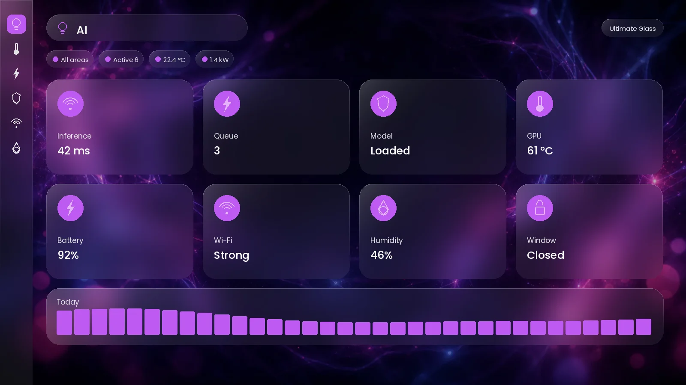

</div>

---

Three complete visual systems, each rendered across 23 areas of the home. Every
area gets its own artwork, its own accent colour, and its own theme entry — so a
dashboard can look like the room it controls.

```
3 modes  ×  (1 base + 23 areas)  =  72 themes
3 modes  ×  23 areas             =  69 backgrounds
```

**Requires** [card-mod](https://github.com/thomasloven/lovelace-card-mod).
Mushroom, Bubble Card and button-card are supported but optional.

---

## Install

### Via HACS (recommended)

<details open>
<summary><b>Step 1 — add this repository</b></summary>

1. **HACS** → **⋮** (top right) → **Custom repositories**
2. Repository: `https://github.com/HomeRiz/Home-Assistant-Ultimate-Theme`
3. Type: **Theme**
4. **Add**

</details>

<details open>
<summary><b>Step 2 — download</b></summary>

Search HACS for **Home Assistant Ultimate Theme** → **Download**.

HACS creates `/config/themes/ultimate-theme/ultimate-theme.yaml` — one file, all
72 themes. Leave it in that subfolder; the include recurses and finds it.
Backgrounds are served from a CDN, so there is nothing else to copy.

</details>

<details open>
<summary><b>Step 3 — enable themes</b></summary>

In `configuration.yaml`:

```yaml
frontend:
  themes: !include_dir_merge_named themes
  extra_module_url:
    - /hacsfiles/lovelace-card-mod/card-mod.js?hacstag=YOUR_TAG
```

If you already have a `frontend:` block, add these lines to it — a second
`frontend:` key is a YAML error.

**The `extra_module_url` line is not optional.** Dashboard resources are loaded
only on Lovelace dashboards, so without it card-mod never runs on Settings,
HACS or Developer Tools — those pages get the colours but no backdrop and no
glass. Copy your exact URL, `hacstag` included, from
Settings → Dashboards → ⋮ → **Resources**, and keep that resource entry as it is:
you need both.

</details>

<details open>
<summary><b>Step 4 — restart and pick a theme</b></summary>

Restart Home Assistant (a theme reload is not enough the first time — the
include is only evaluated at startup).

Then: your username, bottom left → **Theme** → pick one. Start with
`Ultimate Glass - Home`, and set the dropdown beside it to **Dark**.

</details>

That's it. [Full install guide with troubleshooting →](INSTALL.md)

> **Why dark?** All backgrounds are dark so white card text stays readable. Light
> mode works and uses lighter card surfaces, but keeps light text.

### Prefer to self-host the images?

The default build loads backgrounds from jsDelivr. To serve them from your own
Home Assistant instead, copy `www/` to `/config/www/` and rebuild:

```bash
python3 build/generate_themes.py --base local
```

[Why this trade-off exists →](docs/ARCHITECTURE.md#where-backgrounds-come-from)

---

## Gallery

Every area, in all three modes. Full-size previews live in
[`docs/previews/`](docs/previews).

### Ultimate Glass

Heavy blur, 30px radii, no borders, bright specular rim.

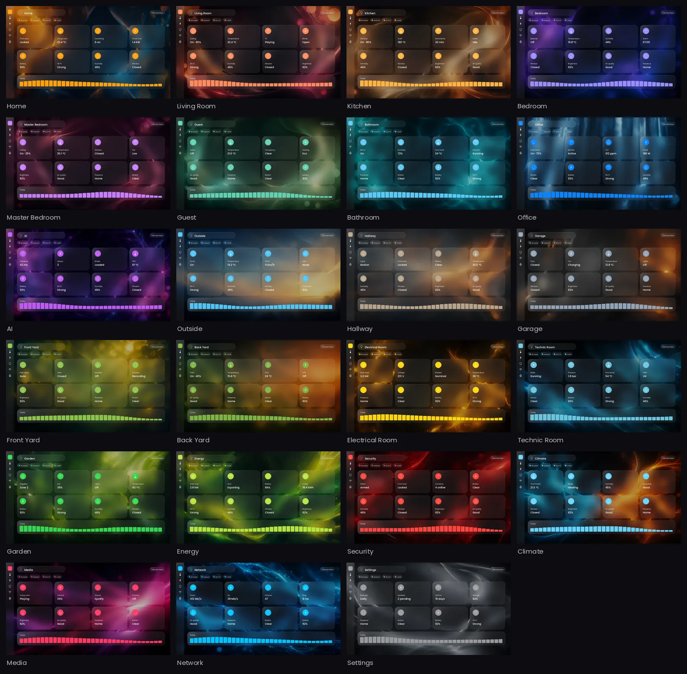

### Ultimate Velvet

Softer blur, 18px radii, hairline borders, muted pastel accents.

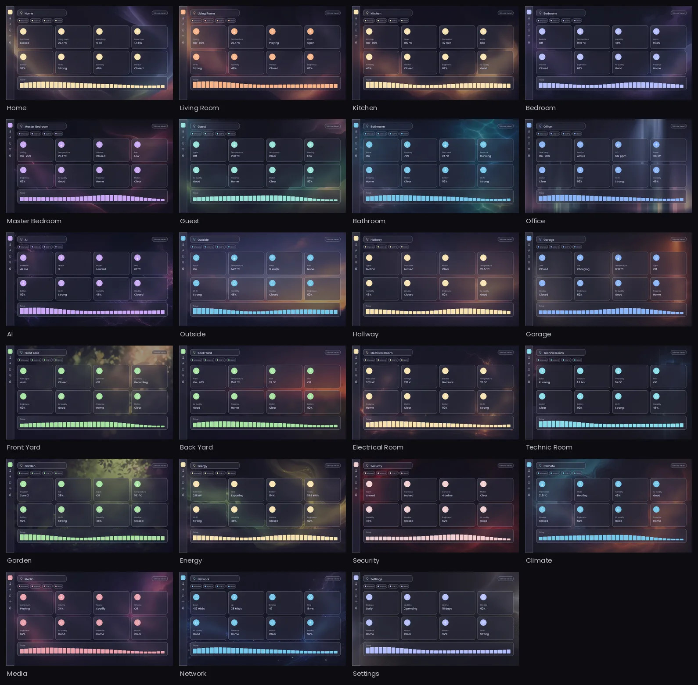

### Ultimate Neon

Near-black, 12px radii, accent borders with outer glow, scanlined backdrops.

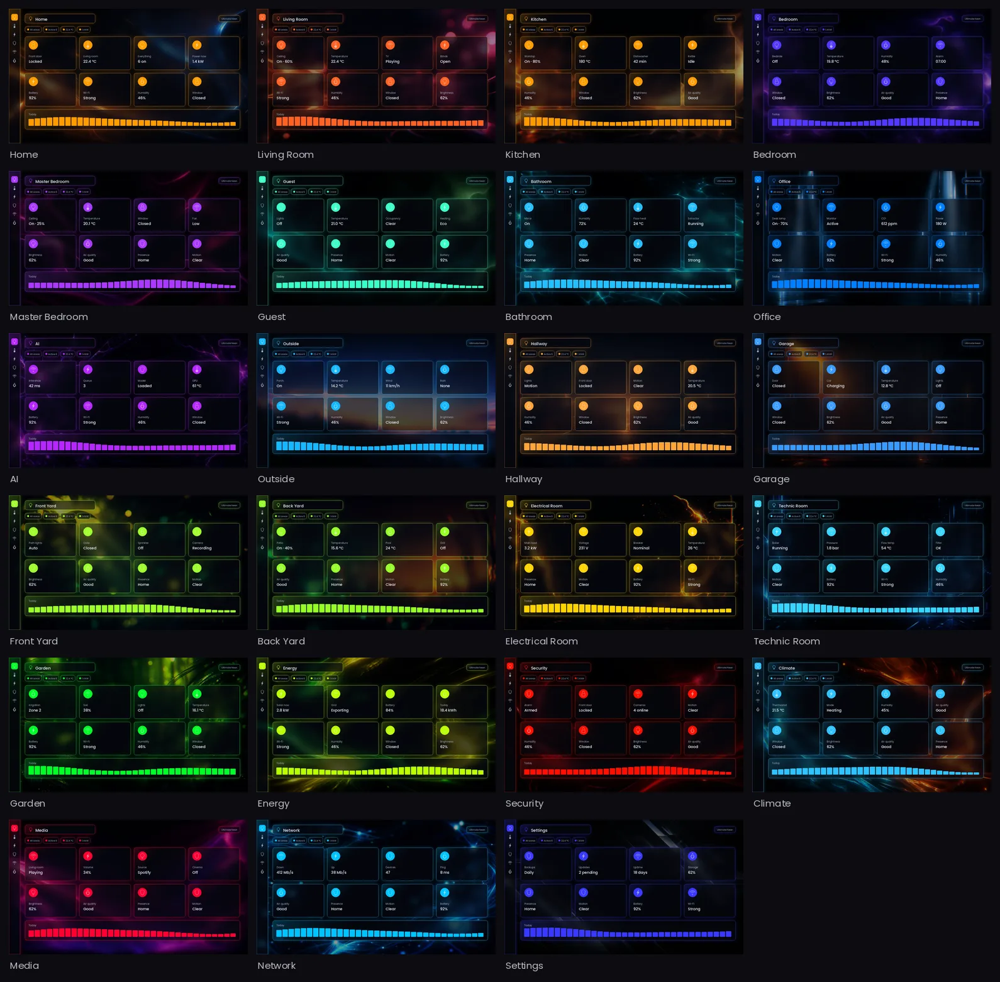

<details>
<summary><b>Side by side — the same area across all three modes</b></summary>

| Glass | Velvet | Neon |
|---|---|---|
| 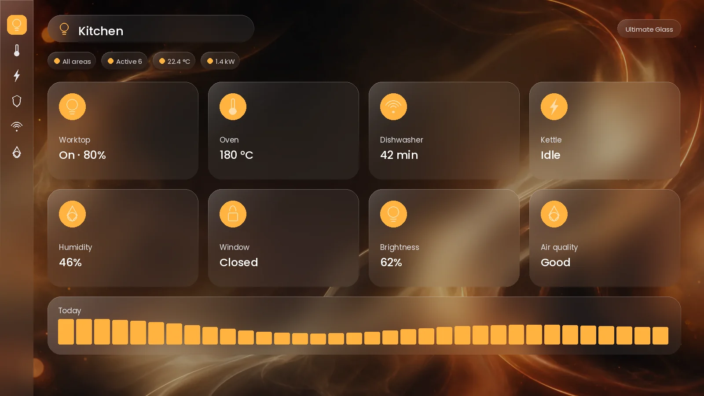 | 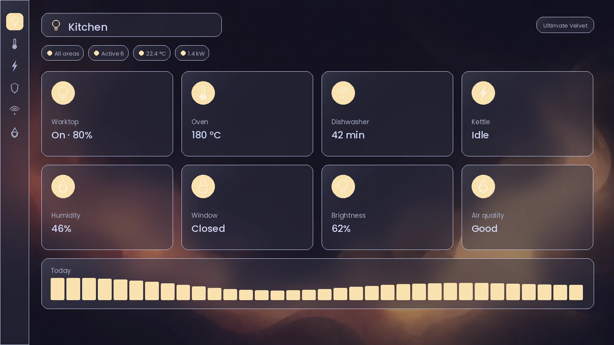 | 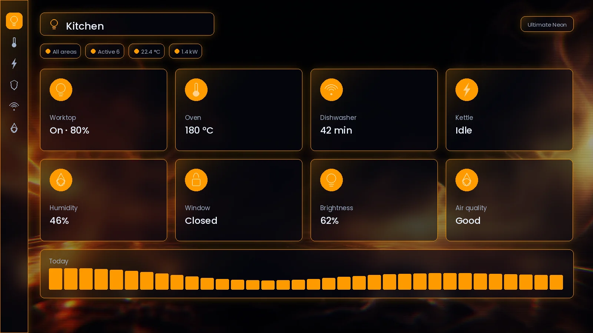 |
| 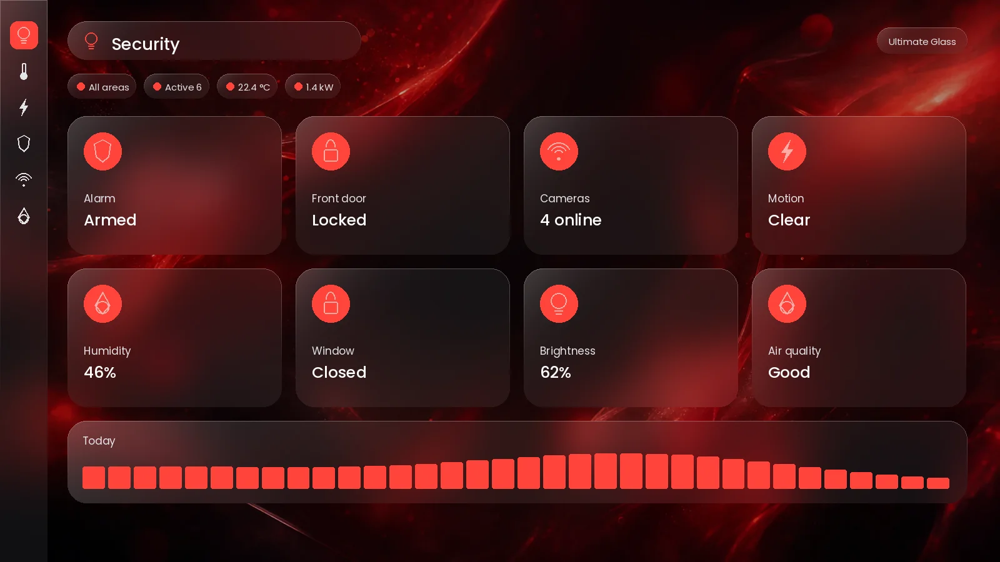 | 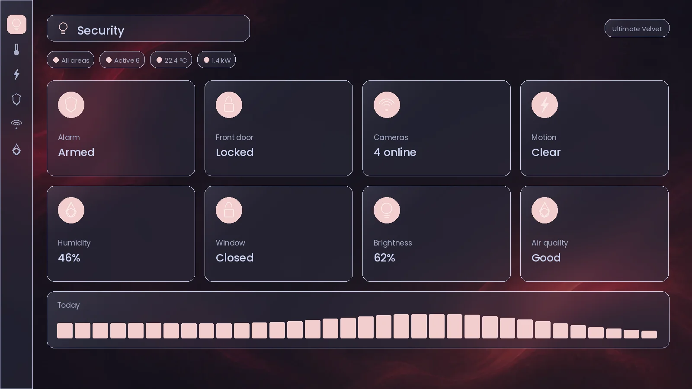 | 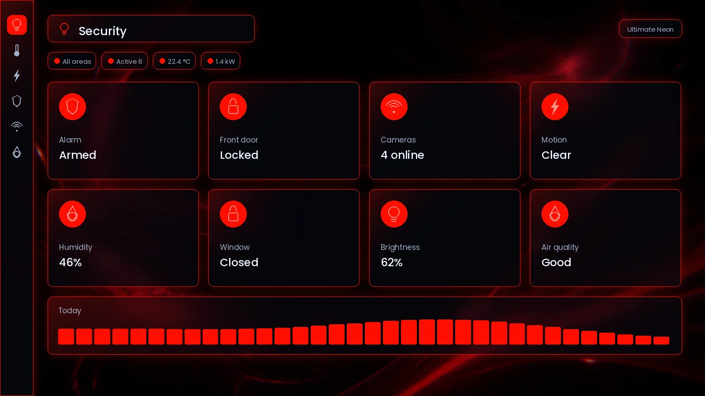 |
| 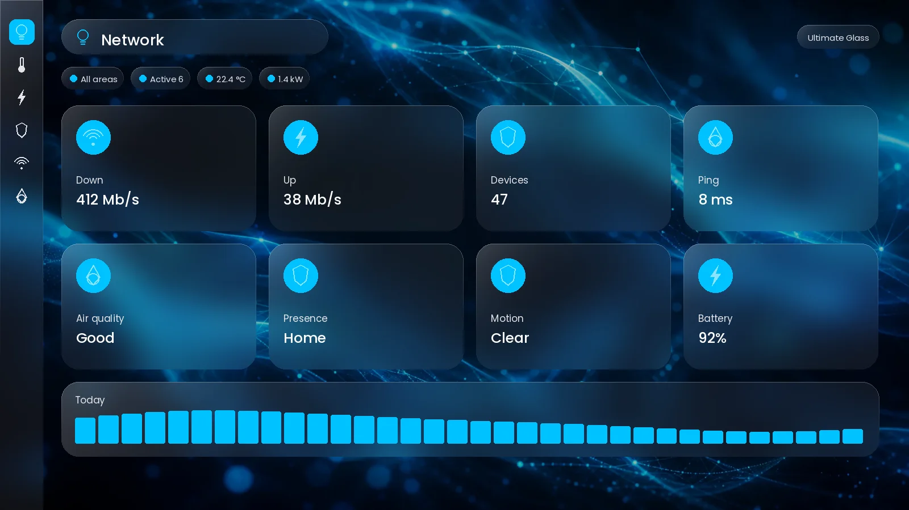 | 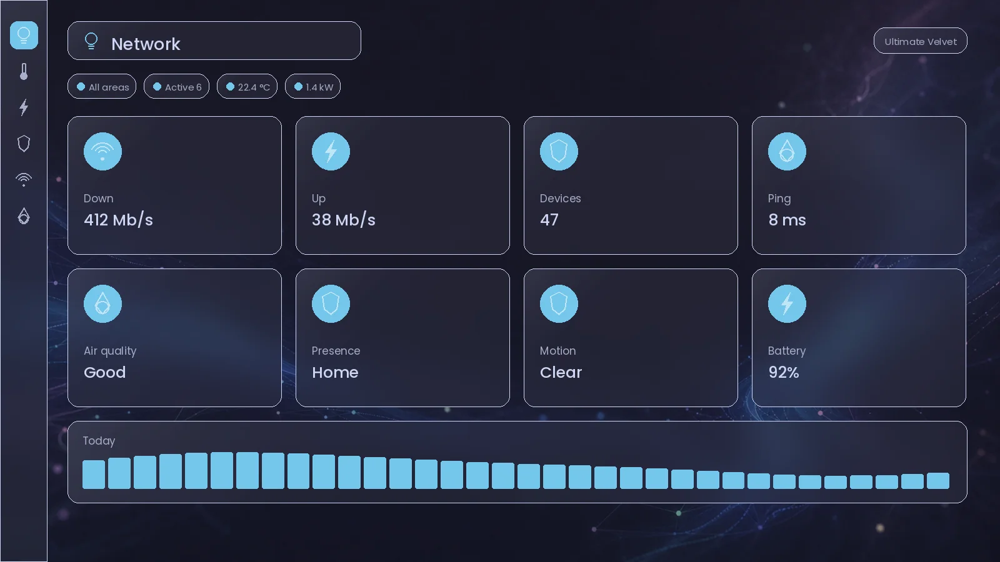 | 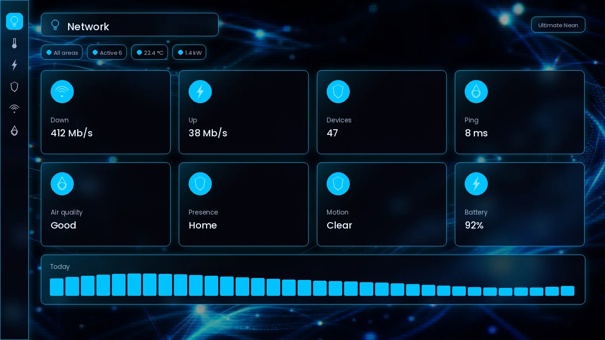 |

The composition is deliberately identical across modes — only palette and grade
change, so a room stays recognisable when you switch aesthetic.

</details>

---

## The three modes

| | Glass | Velvet | Neon |
|---|---|---|---|
| Blur | `blur(16px) saturate(1.45)` | `blur(12px) saturate(1.15)` | `blur(10px) saturate(1.8)` |
| Radius | 30px | 18px | 12px |
| Borders | none | 1px hairline | 1px accent, glowing |
| Character | rich, luminous, soft | muted, cozy, matte | high-chroma, scanlined |

Accents adapt per mode rather than being reused verbatim — Garden's `#32D74B`
becomes `#A6E3A1` in Velvet and `#00FF27` in Neon.

## The 23 areas

`home` · `living-room` · `kitchen` · `bedroom` · `master-bedroom` · `guest` ·
`bathroom` · `office` · `ai` · `outside` · `hallway` · `garage` · `front-yard` ·
`back-yard` · `electrical-room` · `technic-room` · `garden` · `energy` ·
`security` · `climate` · `media` · `network` · `settings`

Adding one is a single line in `build/areas.py`.

---

## Backgrounds per dashboard and per tab

Three levels, most specific wins.

| Level | Sets | How |
|---|---|---|
| Profile | your default everywhere | Profile → Theme |
| Dashboard | one whole dashboard | `theme:` key in the dashboard config |
| View (tab) | a single tab | `card_mod` on the view |

Per tab, in your dashboard's **Raw configuration editor**:

```yaml
theme: Ultimate Glass - Home

views:
  - title: Kitchen
    path: kitchen
    icon: mdi:silverware-fork-knife
    card_mod:
      style: |
        :host {
          --ultimate-view-background: url('https://cdn.jsdelivr.net/gh/HomeRiz/Home-Assistant-Ultimate-Theme@main/www/ultimate-theme/backgrounds/glass/kitchen.webp');
        }
```

`dashboards/per-view-backgrounds.yaml` has a ready-made block for every area in
every mode. [Full guide, including opacity blending →](docs/PER-VIEW-BACKGROUNDS.md)

---

## Features

- **Specular sheen** — a `::after` rim gradient, so cards read as glass rather
  than frosted plastic
- **Graceful degradation** — an `@supports` fallback swaps in solid surfaces
  where `backdrop-filter` is unsupported, instead of rendering unreadable
- **iOS-safe backgrounds** — painted onto a fixed pseudo-element, because
  `background-attachment: fixed` misbehaves on iOS Safari and the companion app
- **Per-view background hook** — one dashboard, a different backdrop per tab
- **Full accent ladder** — `--ha-color-primary-05..95` computed per area
- **Hover lift** — guarded by `prefers-reduced-motion`
- **button-card templates** — `ultimate_glass`, `ultimate_glass_icon`,
  `ultimate_glass_tile`, `ultimate_flat`, `ultimate_neon`
- **Card compatibility** — Mushroom, Bubble Card, heading, glance and text-only
  cards are excluded from the glass layer so they don't double-blur

---

## Customising

Everything is generated. **Never edit `themes/ultimate-theme.yaml`** — it is
rebuilt from `build/` and your changes will be lost.

```bash
pip install numpy Pillow jinja2 pyyaml

python3 build/generate_themes.py      # rebuild themes
python3 build/verify.py               # validates every value in every theme
```

| Want to change | Edit | Then |
|---|---|---|
| How cards look | `build/template.jinja2` | regenerate themes |
| A mode's palette or geometry | `build/modes.py` | regenerate themes |
| Add an area | `build/areas.py` | backgrounds `--resume`, previews `--resume`, themes |
| The artwork itself | `build/generate_backgrounds.py` | re-render that mode |

Copy the rebuilt `themes/ultimate-theme.yaml` onto the instance, then
Developer Tools → **Reload themes**.

Put it *over* the existing file rather than beside it. If you installed via
HACS that means `/config/themes/ultimate-theme/ultimate-theme.yaml`; a second
copy at `/config/themes/ultimate-theme.yaml` defines all 72 theme names twice,
because the include recurses into subfolders.

**If you customise and want HACS to keep managing it:** fork this repository,
push your changes, and add *your fork* as the custom repository instead. Then
your edits survive updates. Copying files over Samba or SSH works too, but HACS
will overwrite them on the next update.

[Architecture, the build pipeline, and how the glass engine works →](docs/ARCHITECTURE.md)

---

## Using your own artwork

The shipped backgrounds are generated procedurally.
[`docs/IMAGE-PROMPTS.md`](docs/IMAGE-PROMPTS.md) has a ready-to-paste prompt for
all 69 images, and [`docs/image-prompts.tsv`](docs/image-prompts.tsv) is the same
list as `target<TAB>prompt` rows if you're driving a batch tool.

```bash
mkdir -p drop-in/{glass,velvet,neon}    # local workspace, not tracked by git

# save yours as drop-in/<mode>/<area-key>.png, then:
python3 build/import_backgrounds.py     # crop, darken, convert, re-tint headers
python3 build/generate_themes.py
```

Anything you don't supply keeps its generated background, so you can replace them
a few at a time.

---

## Troubleshooting

| Symptom | Cause |
|---|---|
| Theme not in the picker | `frontend: themes:` include missing, or no restart yet |
| Everything flat, no blur | card-mod not loading — check Settings → Dashboards → Resources |
| Cards transparent and unreadable | very old Android WebView; update the companion app |
| Backgrounds don't load | CDN blocked on your network — rebuild with `--base local` |
| Edited the theme, nothing changed | Reload themes, then hard refresh (`Ctrl/Cmd + Shift + R`) |
| A custom card looks wrong | it draws its own surface — add it to `EXCLUSIONS` in the template |

[Longer troubleshooting →](INSTALL.md#troubleshooting)

---

## Contributing

Issues and pull requests welcome — see [CONTRIBUTING.md](CONTRIBUTING.md).
Screenshots are the review for anything visual.

## Licence

[MIT](LICENSE). Portions of the CSS derive from other MIT-licensed themes; those
notices are in [NOTICE.md](NOTICE.md).
